  
<h2>Projet Systèmes Distribués</h2>  
<h1>compte rendu</h1>
<h1>Beidja Cheikh</h1>
<h2>1. L'architecture technique du projet</h2>  
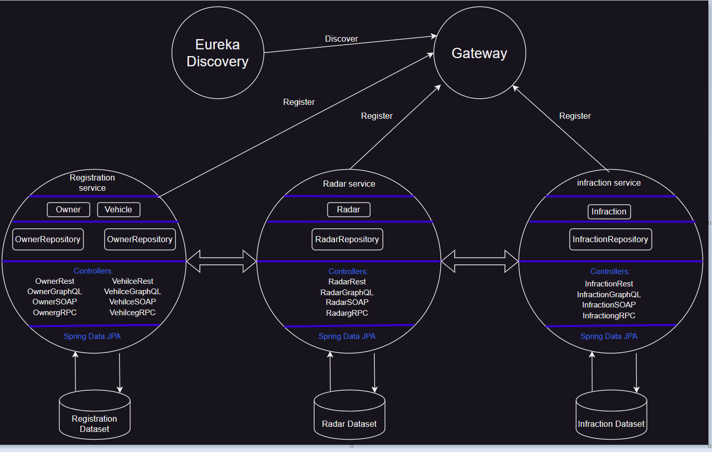  
<h2>2. Diagramme de classe global du projet</h2>  
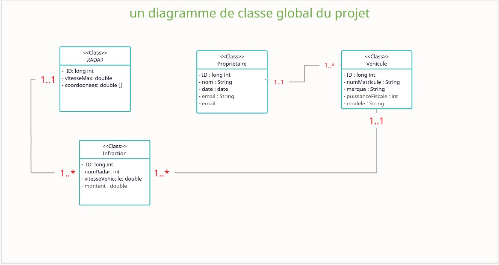  
<h2>3. Développement du micro-service Immatriculation :</h2>
<h2>a. Entités JPA et Interface JpaRepository basées sur Spring data</h2> 
<h3>Entités JPA</h3> 
<h4>1.Entitié Owner</h4> 
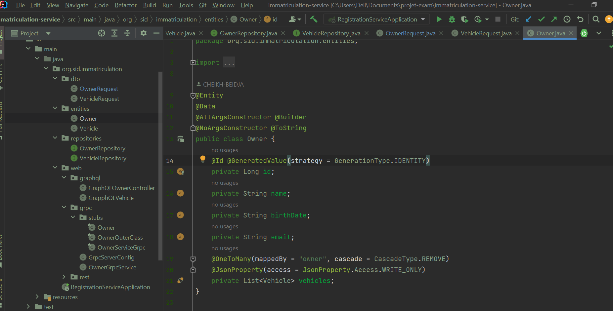  
<h4>2.Entitié Vehicle</h4> 
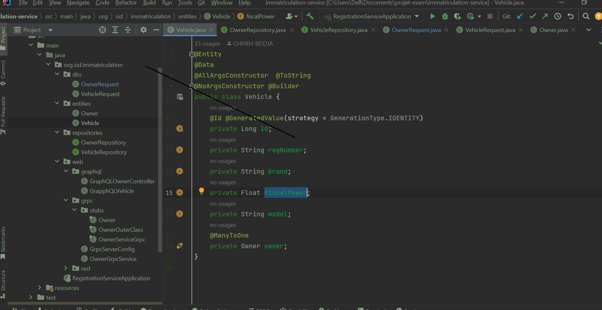  
<h3>Interface JpaRepository basées sur Spring data<</h3>
<h4>1.OwnerRepository</h4> 
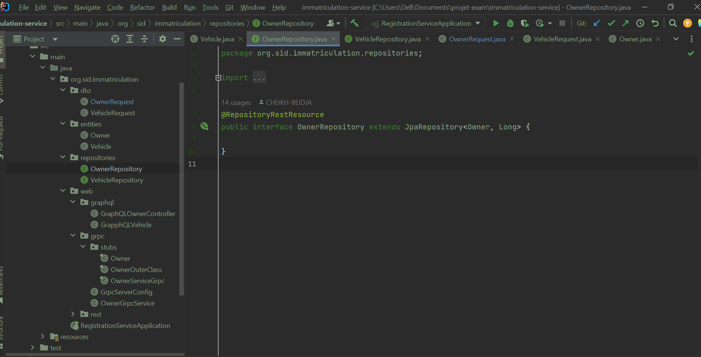  
<h4>1.VehicleRepository</h4> 
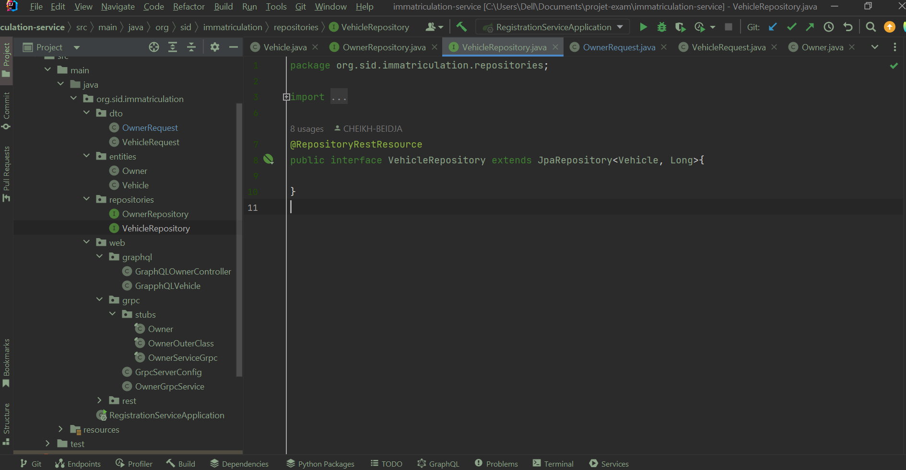  
<h2>b. Les 4 web services REST, GraphQL, SOAP et GRPC</h2>  
<h3>web services REST</h3> 
<h4>OwnerRestController</h4>
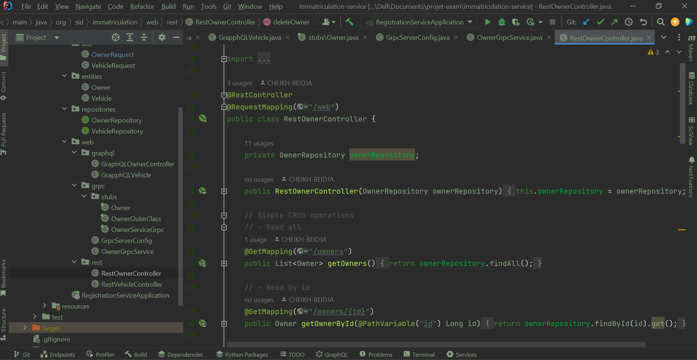  
<h4>Démonstration</h4>
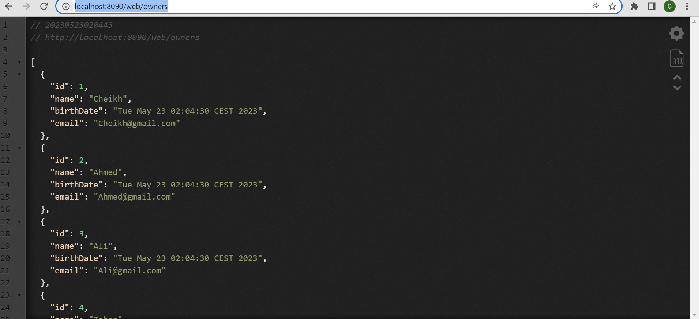  
<h4>VehicleRestController</h4>
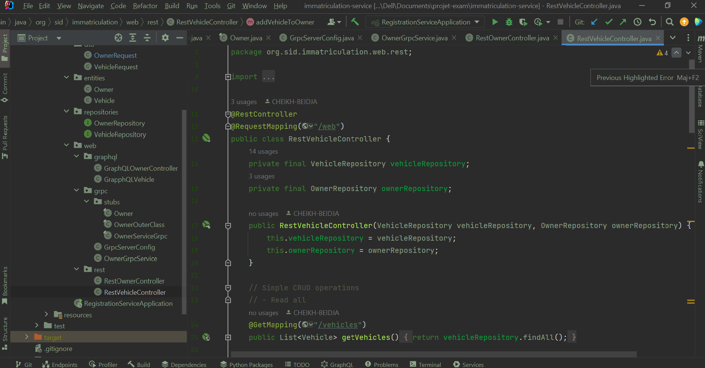  
<h4>Démonstration</h4>
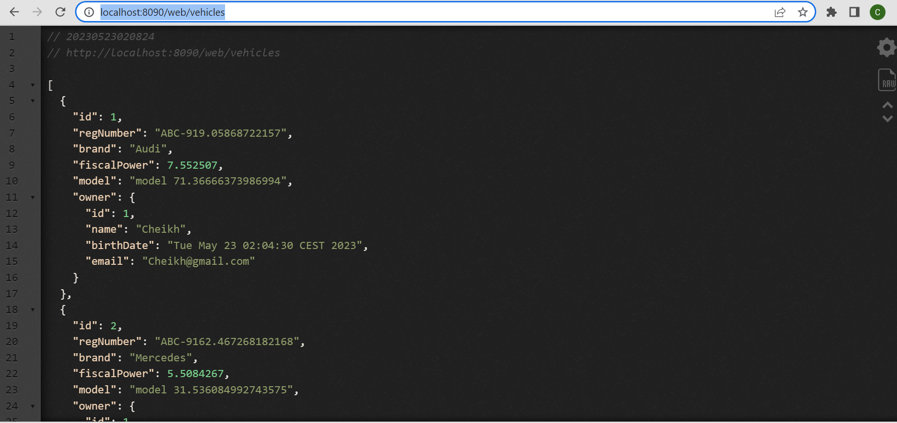  
<h3>web services GraphQL</h3> 
<h4>OwnerGraphqlController</h4>
  
<h4>Démonstration</h4>
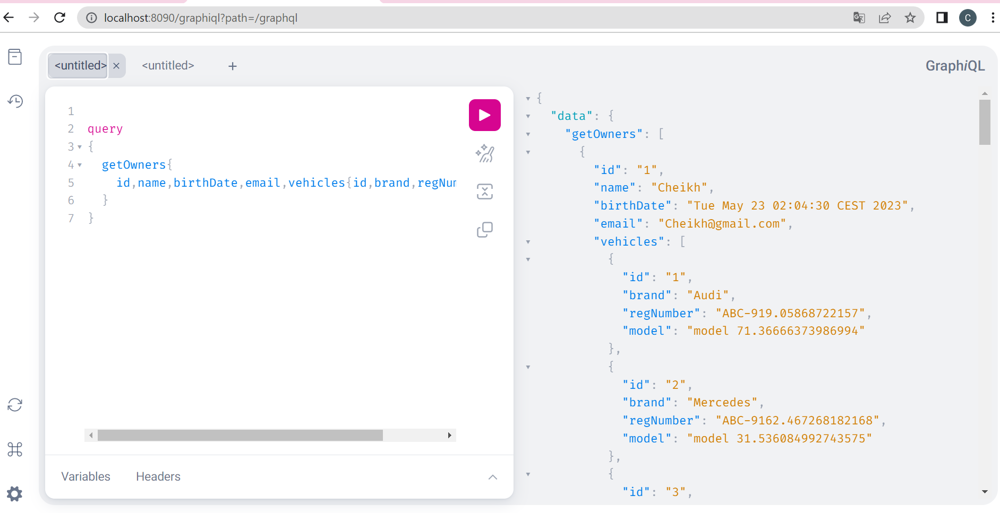  
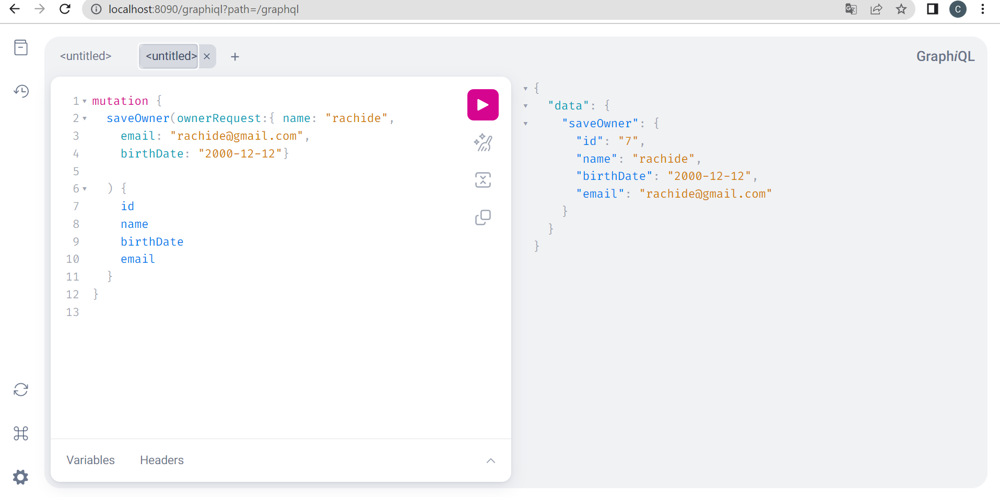  
<h4>VehicleGraphqlController</h4>
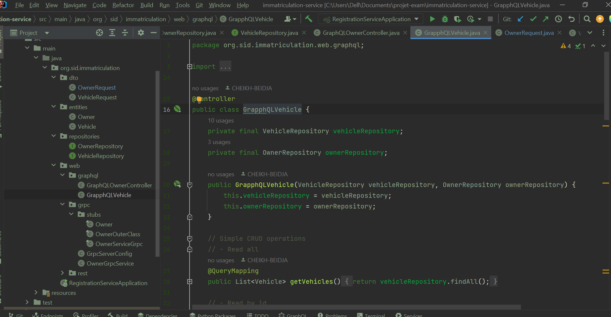  
<h4>Démonstration</h4>
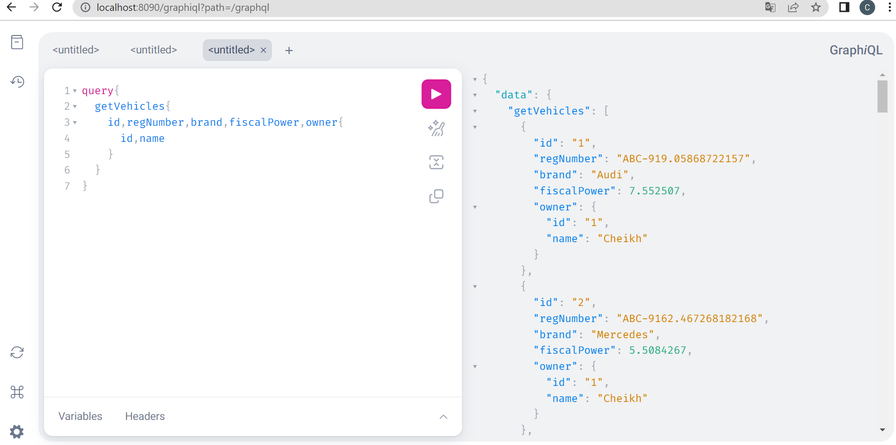  

