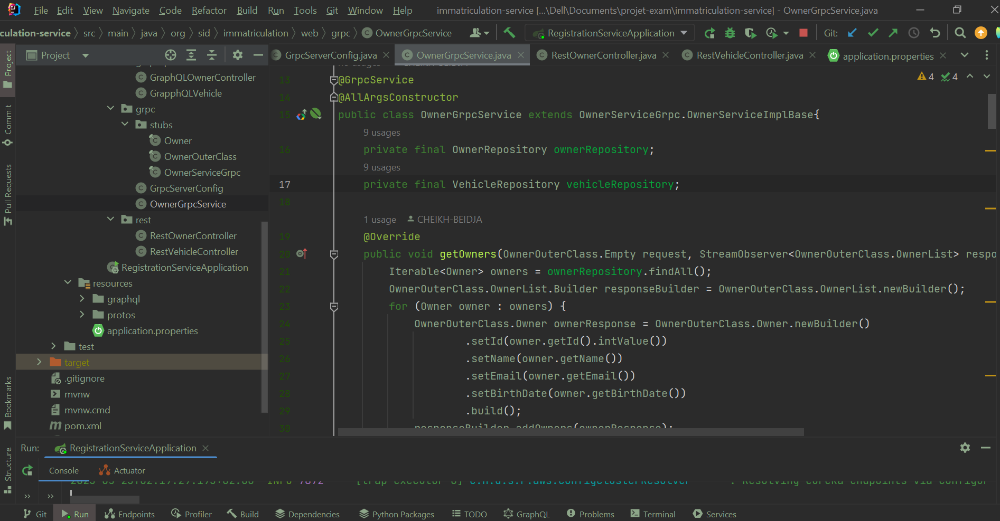
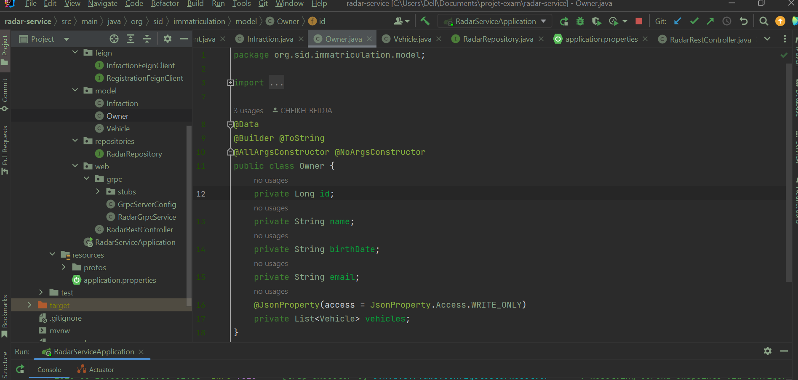
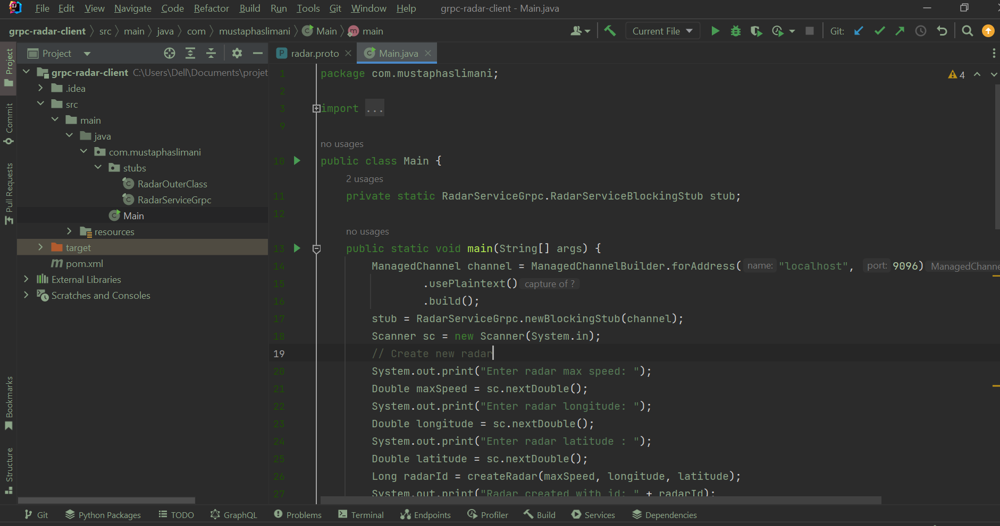
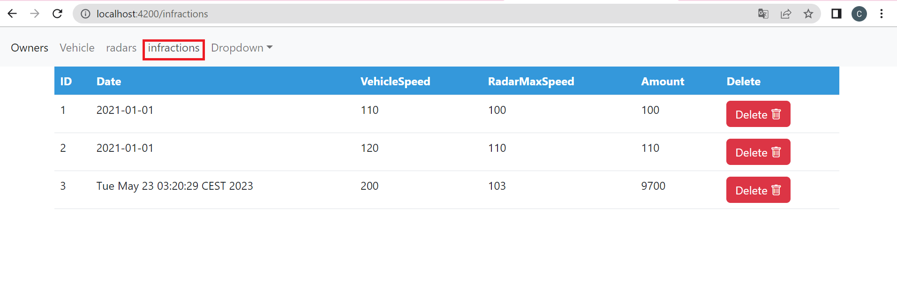

  
<h2>Projet Systèmes Distribués</h2>  
<h1>compte rendu</h1>
<h1>Beidja Cheikh</h1>
<h2>1. L'architecture technique du projet</h2>  
  
<h2>2. Diagramme de classe global du projet</h2>  
  
<h2>3. Développement du micro-service Immatriculation :</h2>
<h2>a. Entités JPA et Interface JpaRepository basées sur Spring data</h2> 
<h3>Entités JPA</h3> 
<h4>1.Entitié Owner</h4> 
  
<h4>2.Entitié Vehicle</h4> 
  
<h3>Interface JpaRepository basées sur Spring data<</h3>
<h4>1.OwnerRepository</h4> 
  
<h4>1.VehicleRepository</h4> 
  
<h2>b. Les 4 web services REST, GraphQL, SOAP et GRPC</h2>  
<h3>web services REST</h3> 
<h4>OwnerRestController</h4>
  
<h4>h2-console</h4>
  
<h4>Démonstration</h4>
  
<h4>VehicleRestController</h4>
  
<h4>h2-console</h4>
  
<h4>Démonstration</h4>
  
<h3>web services GraphQL</h3> 
  
<h4>OwnerGraphqlController</h4>
  
<h4>Démonstration</h4>
  
  
<h4>VehicleGraphqlController</h4>
  
<h4>Démonstration</h4>
  
<h3>web services GRPC</h3> 
  
<h2>4. Développer le micro-service Infractions</h2>
<h4>1.Entitié Infraction</h4> 
  
<h4>2.InfractionRepository</h4> 
  
<h4>h2-console</h4>
  
<h4>Démonstration</h4>
  
<h2>5. Développer le micro-service Radar.</h2>
<h3>Entité Radar</h3>
  
<h4>InfractionFeign</h4>
  
<h4>ImmatriculationFeign</h4>
  
<h4>Model</h4>
<h3>Infraction</h3>
  
<h3>Owner</h3>
  
<h3>Vehicle</h3>
  
<h4>RadarRepository</h4>
  
<h3>h2-console</h3>
  
<h2>6. Créer un application java qui permet de simuler un radar qui génère aléatoirement
des dépassements de vitesses et de les envoyer, via GRPC, au service Radar-Service</h2>
  
<h3>Démonstration</h3>
  
<h2><7. Mettre en place les services techniques de l’architecture micro-service (Gateway,
Eureka Discovery service)</h2>  
<h3>Eureka Discovery service</h3>
  
<h3>Gateway</h3>
  
  
  
<h2>8. Développer votre application Frontend avec Angular ou React</h2>
<h3>Owners List</h3>
  
<h3>Vehicles By Id Owner</h3>
 
  
<h3>Radars List</h3>
  
<h3>Infractions List</h3>
  

